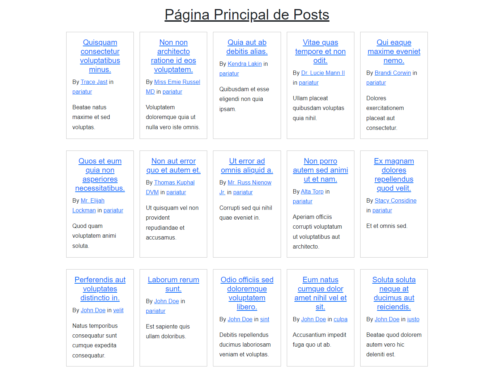
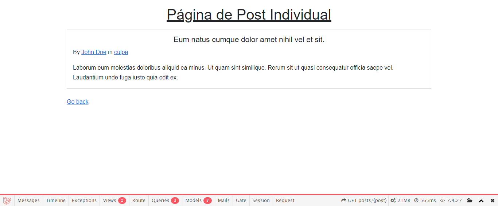

# Proyecto de Blog con Laravel

El objetivo de este ejercicio es realizar la construcción de un blog (modo CMR) mediante el framework Laravel y un tutorial de [laracasts](https://laracasts.com/series/laravel-8-from-scratch).

Para ello se han utilizado los comandos "composer" para crear el directorio y "php artisan serve" para correr el servidor, además de modificar el archivo ".env" para poner las variables de conexión con la base de datos creada a la par del proyecto.

Adicionalmente, en este ejercicio se ha implementado una barra de control en el pie de la aplicación para una mejor visualización de las rutas, los modelos, las vistas, etc. Se ha hecho con el comando "composer require barryvdh/laravel-debugbar --dev" + "composer fund".

Durante la elaboración de las distintas partes del ejercicio se ha ido pasando de unos métodos más estáticos (html) a dinámicos (php y elementos relacionados como blade). Un desglose resumido de este proceso es el siguiente:

## Usando Laravel Básico, Creando Posts de un Blog y Usando Blades

El funcionamiento del framework se asemeja al del Modelo Vista-Controlador, las carpetas y los elementos más importantes son:

- app/Models/* -> donde se encuentran los modelos de las clases del proyecto, luego se profundizará en ella.
- database/* -> donde se maneja la base de datos, también se verá más tarde.
- public/* -> para insersatr hojas de estilos y scripts.
- resources/views/* -> donde se encuentran las vistas del front-end del blog, por defecto se encuentra un welcome.blade.php con información sobre laravel.
- routes/web.php -> un archivo muy importante ya que desde él se redireccionan todas las rutas de la aplicación.

Al principio, el blog se construye con una serie de archivos html estáticos que se recogen en un blade.php junto a un link a la hoja de estilos de public/. Aunque el sistema es funcional, incluso se pueden declarar variables y links para facilitar las rutas a los distintos posts (html) que se crean o utilizar caching para facilitar las operaciones, no es una web dinámica en absoluto. 

Para tener un blog dinámico, el primer paso es crear una clase Post (en app/Models/) que se encargará de recoger todas las funciones que se le quieran dar a ese elemento, como la de encontrar los posts. Además se cambia la forma de enrutar en web.php y se deben modificar las vistas para que también sean dinámicas y respondan a la clase. Aún así todavía se utilizan los archivos html para imprimir los posts por pantalla, es decir, todavía hay elementos estáticos en la programación, pero ya se han separado los meta-datos de su contenido.

La forma de simplificar las vistas es usar el formato **blade**, que funciona como templates y trae muchas opciones de sintaxis y componentes que facilitan la construcción de las páginas. Laravel traduce blade a php vainilla e incluso guarda esa información en los archivos de la carpeta storage/framework/views.

Los blades se encuentran dentro de resources/views, y es recomendable tener también una carpeta de componentes (como los de js) donde se pueden agrupar elementos html que funcionen como plantillas. En el caso de este blog se crea un layout.blade.php para que sea el esqueleto de la app, ahí se referencian todos los estilos o scripts. Como archivos principales se encuentran posts.blade.php (listado) y post.blade.php (artículos individuales).

## Conectando a una Base de Datos

Como ya se ha mencionado, para modificar datos de la database se actúa sobre el archivo ".env". Después se crea mediante terminal si aún no lo está y corremos "php artisan migrate" para que se generen varias tablas pre-establecidas. Para manejar la base de datos y hacer operaciones se usará la aplicación de escritorio TablePlus, creando una conexión con la base local podemos visualizar las tablas y todas sus características.

## Migraciones, Modelos y Relaciones Elocuentes

El tutorial hace un pequeño recorrido de los comandos disponibles para las migraciones de la base de datos, ya que las tablas se estarán limpiando y refrescando constantemente en la elaboración del blog. En la carpeta "database/migrations" están los archivos correspondientes a las tablas, con sus clases y métodos especificados dentro.

Una de las tablas creadas se corresponde a la clase por defecto User, y mediante la terminal (abriendo php artisan tinker) se pueden realizar múltples funciones sobre ella porque laravel establece entre esos elementos una relación elocuente y directa.

El objetivo es conseguir un modelo elocuente con la clase Post, por lo que se crea un nuevo modelo y su correspondiente migración (tabla) mediante los comandos de php artisan, así como una serie de posts para visualizar el resultado. Por el momento los datos se introducen de forma manual, y se debe tener cuidado con que se mantengan los formatos adecuados.

También se producen cambios en web.php, dependiendo de qué elementos se dispone para referenciar en las rutas. Además lo óptimo es que laravel sepa directamente qué post queremos según su variable, lo que se conoce como "route model binding" o "enlace de modelo de ruta".

Volviendo a los Modelos, la primera relación elocuente se realiza entre las clases Post y Category (creando el modelo y la migración de esta), ya que es lo típico en un blog. Es necesario crear una nueva columna (category_id) en posts para que estos se correspondan con una categoría y poder asociar una tabla con la otra. Así se pueden crear posts que correspondan a una categoría concreta.

El próximo paso es hacer una página donde se vean todos los posts de una categoría, para lo que se crea una ruta nueva en web.php y la función indicada en la clase Category. Añadido a la modificación de los blades se obtiene todo lo necesario para esta funcionalidad.

Llegados a este punto se encuentra el **problema N+1**, es un defecto de código por el cual se producen demasiadas queries desde la base de datos, pero se soluciona modificando la sintaxis de la ruta en web.php.

Otro punto es que no existe una relación directa entre las tablas users y posts, así que se crea igual que la de categorías (esta vez columna user_id) y se refrescan las migraciones. La relación también debe ser elocuente así que se declaran las funciones pertienetes en las clases de los modelos.

## Database Seeding y Factories

Las migraciones constantes cuando hay un cambio en las tablas incluye perder los datos constantemente. En fase de aprendizaje y servidor local no es un gran problema, pero en una producción profesional puede suponer la pérdida de mucho trabajo. 

El archivo database/seeders/DatabaseSeeder.php contiene funciones para sembrar la base de datos con filas de registros, los que el programador le especifique. El comando es "php artisan db:seed" y se puede utilizar las veces que se quiera, pero trae el problema de que duplica los registros. Entonces se escoge "php artisan migrate:fresh --seed", que borra las tablas, las migra de nuevo y las siembra de datos; y el método truncate para evitar el duplicado.

Aunque el Seeding es muy práctico para introducir datos en masa, estos todavía deben escribirse manualmente y suponen un gasto de tiempo considerable. Para evitar esto se utilizan las Factories, archivos que se corresponden a los modelos del blog y que contienen una función que devuelve datos generados aleatoriamente, algo muy útil para el testeo del blog.

Entonces, lo que se hace en DatabaseSeeder es llamar a la factory para que creen los atributos falsos. Se limpia la sintaxis manual anterior y todo funciona correctamente.

## Posts de un Autor y Cargar Relaciones

Al igual que con las categorías, un blog suele tener la opción de clicar en un autor y ver todos sus posts. Ya puestos se cambia la variable $user por $author en las vistas y la ruta, y se indica que la llave a la que se hace referencia sigue siendo user_id para que no haya errores.

Por último se añade una nueva columna "username" para que la url del blog muestre al autor y no el id por defecto, tanto en la migración como en la factory.

Las relaciones autor-post y categoría-post, al hacerse en modelos ya existentes, vuelven a presentar el problema N+1, por lo que se deben modificar las rutas de web.php para solventarlo. Otra forma de hacerlo es declarar la variable protegida $with en las clases y usar el mismo método en las rutas.

En este punto se han visualizado y reproducido 30 vídeos del tutorial de laravel. Para un desglose más extenso dirigirse al README del proyecto.

## Otras tareas realizadas

- Uso de Git y GitHub para la creación de un repositorio remoto con varias ramas en las que se han dividido los contenidos del ejercicio.
- Uso de terminal de laragon y de php artisan para comandos.
- Comentario y documentación constante de código a medida que se avanzaba en el tutorial.
- Implementación de un estilo css simple para la presentación del blog, ya que no se ha llegado a desarrollar los estilos del tutorial.

## Algunas capturas del blog

Página de todos los posts ordenados con un grid:

Página de un post individual:

